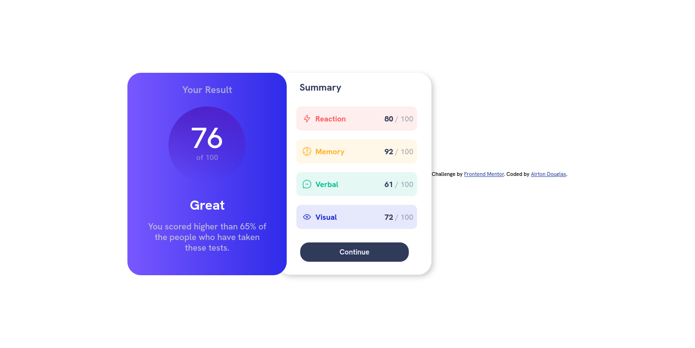

# QR code component solution - HTML and CSS pure

This is a solution to the [QR code component challenge on Frontend Mentor](https://www.frontendmentor.io/challenges/qr-code-component-iux_sIO_H). In this code i'm using the basic HTML and CSS.

## Table of contents

- [Overview](#overview)
  - [Screenshot](#screenshot)
  - [Links](#links)
- [My process](#my-process)
  - [Built with](#built-with)
  - [What I learned](#what-i-learned)
  - [Continued development](#continued-development)
  - [Useful resources](#useful-resources)
- [Author](#author)
- [Acknowledgments](#acknowledgments)

## Overview

### Screenshot

### Links

- Live Site URL: [Vercel-Live-Site](https://resulst-summary-component.vercel.app/)

## My process

### Built with

- Semantic HTML5 markup
- CSS custom properties
- Flexbox
- JS for data fetching from JSON file

### What I learned

I learn to start my own project alone, use media query to resizing the page for mobile,aply flexbox to make the text show in center and aligned in center, I've used flex-wrap too, in the way to make the title not to be on the side of the description. 

### Continued development

In this project development I see that, I've to see more about flexbox and how I can master this tool to make my pages even better

### Useful resources

- [Example resource 1](https://www.youtube.com/watch?v=G3e-cpL7ofc) - This helped me for flexbox and in this course that I finished I've learned how to think in blocks to create containers and organize them all in classes.
- [Example resource 2](https://github.com/AirtonDoug/YouTubeClone) - By using the project that I made I see some parts that help me especially on the resizing the page for mobile and the flexbox part.

## Author

- Github - [Airton Douglas ](https://github.com/AirtonDoug/)
- Frontend Mentor - [@yourusername](https://www.frontendmentor.io/profile/AirtonDoug)

